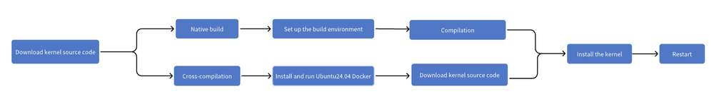
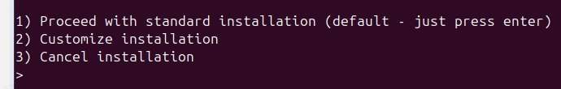

---


# Display h2 to h5 headings

## toc\_min\_heading\_level: 2  
toc\_max\_heading\_level: 4

import Tabs from '@theme/Tabs'; import TabItem from '@theme/TabItem';

# Linux 内核

本章介绍如何为RUBIK Pi 配置和构建自定义内核。

RUBIK Pi 内核托管在 [GitHub](https://github.com/rubikpi-ai/linux-ubuntu)。该更新落后于 [upstream Linux kernel](https://github.com/torvalds/linux)。目前RUBIK Pi 3 Ubuntu 24.04 LTS的内核版本为6.8.12。

## 更新内核

在使用 `sudo apt upgrade` 命令进行更新时，您的内核将自动更新到最新的稳定版本。如果想尝试最新的不稳定测试内核，[下载最新的内核源码](#downloade_linux_code)并[手动编译和更新内核](#Native_and_cross_builds)。

## 编译内核

编译内核分为本地构建（Native builds）和交叉编译（Cross-compilation）两种方式。

魔方派 3 上默认安装的编译器和链接器可以构建在魔方派 3 上运行的可执行文件，为本地构建;

交叉编译是为不同平台生成可执行代码的过程，例如在 x86\_64 机器上构建 ARM 架构可执行文件。



<a id="downloade_linux_code"></a>

### 下载内核源代码

为任何目标平台构建都需要内核源代码。获取内核源代码需要使用 Git。如果您尚未安装 Git，请先在设备上安装：

```shell
sudo apt install git
```

然后下载最新的 RUBIK Pi 3 内核的源代码：

```shell
git clone https://github.com/rubikpi-ai/linux-ubuntu.git
```

这可能需要几分钟。:::note 上面的 `git clone` 命令将下载当前活动分支，包括所有提交历史记录和文件历史记录。如果只需要最新的源代码，请使用 `git clone --depth 1 https://github.com/rubikpi-ai/linux-ubuntu.git` 命令来减少下载的大小。

如果要下载其他分支的源代码，请在克隆后切换到所需的分支：进入下载目录，运行 `git checkout <branch-name>` 命令切换到所需的分支。

关于可用分支列表，请见 [RUBIK Pi kernel GitHub repository](https://github.com/rubikpi-ai/linux-ubuntu.git)。:::

<a id="Native_and_cross_builds"></a> 现在您有了内核源代码，可以本地构建或通过交叉编译构建一个新内核。

<Tabs>
  <TabItem value="Native builds" label="Native builds" default>
    **First, install the compilation dependencies on RUBIK Pi 3**
    ```shell
    sudo apt install bc bison flex libssl-dev make gcc debhelper cpio dwarfdump \
    zstd llvm clang libclang-dev gawk dwarves libelf-dev dkms zip rustup
    ```
    **Then, navigate to the kernel directory and set up the Rust environment:**
    ```shell
    cd linux-ubuntu
    curl --proto '=https' --tlsv1.2 -sSf https://sh.rustup.rs | sh
    cargo install --git https://github.com/rust-lang/rust-bindgen --tag v0.65.1 bindgen-cli
    sudo cp ~/.cargo/bin/bindgen /usr/bin/bindgen
    sudo cp /usr/bin/bindgen /usr/bin/bindgen-0.65
    rustup override set $(scripts/min-tool-version.sh rustc)
    rustup component add rust-src
    ```
    If the following content appears, press **Enter** to use the default configuration.
    
    
    Run the following command to verify that the Rust environment is configured successfully.
    ```shell
    make LLVM=1 rustavailable
    ```
    
    If the Rust environment is configured successfully, the following output will appear:
    
    ```
    Rust is available!
    ```
    **Next, build the kernel. This step may take a long time.**
    ```shell
    fakeroot debian/rules clean
    fakeroot debian/rules build
    fakeroot debian/rules binary
    ```
    :::note
    The command `fakeroot debian/rules build` will automatically compile the kernel in parallel based on the number of CPU cores. RUBIK Pi has 8 CPU cores, so 8 threads will be used to compile the kernel.
    :::
    
    **Install the kernel:**
    
    Navigate to the parent directory of linux-ubuntu, then install the generated kernel package onto the system.
    ```shell
    cd ..
    sudo dpkg -i linux-*.deb
    ```
    **Finally, run the following command to reboot your RUBIK Pi 3 and boot into the newly compiled kernel:**
    ```shell
    sudo reboot
    ```

  </TabItem>
  <TabItem value="Cross-compilation" label="Cross compilation">
    You need a suitable Linux cross-compilation host. We recommend that you perform the cross-compilation within a Docker container hosted on an Ubuntu 24.04 system.
    **First, click [here](https://thundercomm.s3.dualstack.ap-northeast-1.amazonaws.com/uploads/web/rubik-pi-3/tools/ubuntu-24.04.tar) to download the Docker image.**
    **Run the following command to import the Docker image and run it:**
    :::note
    If you have not installed Docker, run the `apt install docker.io` command to install Docker.
    When running Docker, you need to specify the local working directory to the Docker container. For example, */home/rubikpi/ubuntu* is the local working directory, and */home/ubuntu/prj* is the working directory inside the Docker container. Make sure that your local working directory contains the kernel source code directory *linux-ubuntu*.
    :::
    ```shell
    sudo docker load -i ubuntu-24.04.tar
    sudo docker run --name  ubuntu24.04 --privileged -it -v /home/rubikpi/ubuntu:/home/ubuntu/prj dokken/ubuntu-24.04 /bin/bash
    sudo passwd root
    sudo passwd ubuntu
    su ubuntu
    ```
    **Install the build dependencies in Ubuntu 24.04 Docker:**
    ```shell
    sudo apt update
    sudo apt install -y debhelper gcc-13-aarch64-linux-gnu/noble-updates \
    gcc-11-aarch64-linux-gnu g++-11-aarch64-linux-gnu cpio dwarfdump/noble \
    zstd llvm clang libclang-dev make gawk flex bison git libssl-dev bc dwarves \
    libelf-dev dkms zip
    
    **Navigate to the kernel directory and configure the Rust environment:**
    ```shell
    cd prj/linux-ubuntu
    
    curl --proto '=https' --tlsv1.2 -sSf https://sh.rustup.rs | sh
    cargo install --git https://github.com/rust-lang/rust-bindgen --tag v0.65.1 bindgen-cli
    sudo cp ~/.cargo/bin/bindgen /usr/bin/bindgen
    sudo cp /usr/bin/bindgen /usr/bin/bindgen-0.65
    rustup override set $(scripts/min-tool-version.sh rustc)
    rustup component add rust-src
    ```
    
    If the following content appears, press **Enter** to use the default configuration.
    
    
    Run the following command to verify that the Rust environment is configured successfully.
    ```shell
    make LLVM=1 rustavailable
    ```
    
    If the Rust environment is configured successfully, the following output will appear.
    
    ```
    Rust is available!
    ```
    **Next, build the kernel. This step may take a long time.**
    ```shell
    export ARCH=arm64
    export $(dpkg-architecture -aarm64)
    export CROSS_COMPILE=aarch64-linux-gnu-
    export HOSTCC=clang
    
    fakeroot debian/rules clean
    fakeroot debian/rules build
    fakeroot debian/rules binary
    ```
    :::note
    
    The command `fakeroot debian/rules build` will automatically compile the kernel in parallel based on the number of CPU cores. RUBIK Pi has 8 CPU cores, so 8 threads will be used to compile the kernel.
    :::
    
    **Install the kernel**
    
    Next, navigate to the parent directory of the *linux-ubuntu* directory, and transfer the generated kernel package to RUBIK Pi 3. You can use a USB drive, SSD, or commands like `scp` or `adb push` to transfer the files.
    Run the following command to install the kernel on RUBIK Pi 3：
    
    ```shell
    cd ..
    sudo dpkg -i linux-*.deb
    ```
    **Finally, run the following command to run the newly compiled kernel on RUBIK Pi 3:**
    
    ```shell
    sudo reboot
    ```

  </TabItem>
</Tabs>
## 配置内核

Linux 内核具有高度可配置性。一些用户可能希望修改默认配置以满足自己的需要，例如启用新的或实验性的网络协议，或启用对新硬件的支持。

配置通常通过 make menuconfig 界面完成。或者，您可以手动修改*.config*文件，但这可能更具挑战性。

### 准备配置

menuconfig工具需要ncurses开发头文件才能正确编译和运行。要安装这些头文件，请运行以下命令：

```shell
sudo apt install libncurses5-dev
```

接下来，[下载内核源代码](#downloade_linux_code)。特别要注意的是，确保您已经完成了[本地编译或交叉编译](#Native_and_cross_builds)步骤。

### menuconfig

完成所有设置后，现在可以编译并运行menuconfig程序，如下所示：

<Tabs>
  <TabItem value="Native builds" label="Native builds">
    ```shell
    cd linux-ubuntu/debian/build/build-rubikpi
    make menuconfig
    ```

  </TabItem>
  <TabItem value="Cross-compilation" label="Cross-compilation">
    ```shell
    cd prj/linux-ubuntu/debian/build/build-rubikpi
    make ARCH=arm64 CROSS_COMPILE=aarch64-linux-gnu- menuconfig
    ```

  </TabItem>
</Tabs>
使用键盘操作menuconfig：

* 使用箭头键进行方向移动。

* 按**Enter**进入子菜单（以 ---> 表示）。

* 按两次**Esc**返回上一级或退出。

* 使用空格键切换选项的启用/禁用状态。

* 按**Enter**打开子菜单，使用箭头键浏览子菜单，然后再次按**Enter**选择状态。

* 按**H**获取有关选项或菜单的帮助。

快速编译后，menuconfig将显示包含所有可配置选项的子菜单列表。选项较多，请耐心阅读。第一次尝试时，请不要启用或禁用大量选项。配置很容易被破坏，因此最好一次只进行少量更改，并熟悉配置和构建过程。

### 保存更改

进行更改后，按住**Esc**键，直到系统提示您保存新配置。默认情况下保存到*.config*文件中。您可以通过复制此文件来保存和加载配置。

自定义完成后就可以构建内核了。<Tabs> <TabItem value="Native builds" label="Native builds"> \`\`\`shell cd linux-ubuntu

    fakeroot debian/rules build
    ```

  </TabItem>
  <TabItem value="Cross-compilation" label="Cross-compilation">
    ```shell
    cd prj/linux-ubuntu
    export ARCH=arm64
    export $(dpkg-architecture -aarm64)
    export CROSS_COMPILE=aarch64-linux-gnu-
    export HOSTCC=clang
    
    fakeroot debian/rules build
    ```

  </TabItem>
</Tabs>
内核构建完成后，请参考[Compile the kernel](#Native_and_cross_builds)安装内核。

## 应用内核补丁

构建自定义内核时，您可能希望将补丁或补丁集（补丁的集合）应用到 Linux 内核。

硬件制造商有时会提供补丁集作为临时措施，以便在补丁合并到 Linux 内核和 RUBIK Pi 内核之前支持新硬件。但是，也有用于其他目的的补丁集，例如启用完整的内核抢占以支持实时使用。

### 确认您的内核版本

要查看设备当前运行的内核版本，运行以下命令：

```shell
uname -r
```

在应用补丁之前，请务必检查内核版本。在内核源码目录下，运行以下命令检查内核版本：

```shell
head Makefile -n 4
```

应该会出现类似于以下内容的输出。

```
# SPDX-License-Identifier: GPL-2.0
VERSION = 6
PATCHLEVEL = 8
SUBLEVEL = 12
```

在本例中，源代码适用于 6.8.12 内核。

### 应用补丁

补丁的应用取决于补丁分发的格式。

开发人员将大多数补丁以单个文件的形式分发。使用补丁程序来应用这些补丁。以下命令将下载、解压并使用实时内核补丁来修补我们的示例内核版本：

```shell
wget https://www.kernel.org/pub/linux/kernel/projects/rt/6.8/patch-6.8.2-rt11.patch.gz
gunzip patch-6.8.2-rt11.patch.gz
cat patch-6.8.2-rt11.patch.gz | patch -p1
```

有些开发人员可能会以电子邮件的形式分发补丁，即一个包含多个补丁文件的文件夹。使用 Git 应用这些补丁。  
在使用 Git 应用电子邮件补丁之前，请使用名称和电子邮件配置本地 Git 安装：

```shell
git config --global user.name "your name"
git config --global user.email "your email"
```

使用 Git 来应用通过电子邮件分发的补丁，请运行以下命令：

```shell
git am -3 /path/to/patches/*
```

请务必遵循补丁分发者提供的说明。例如，某些补丁集需要针对特定提交进行修补。

### 内核头文件

要编译内核模块，您需要 Linux 内核头文件。这些头文件提供了构建与内核交互的代码所需的函数和结构定义。

如果您从 GitHub 克隆了整个内核，这些头文件将包含在源代码树中。如果您不需要所有额外的文件，请使用`apt` 命令在 RUBIK Pi 3 中仅安装内核头文件。

```shell
sudo apt install linux-headers-$(uname -r)
```

:::note 安装内核头文件可能需要几分钟,过程中没有进度指示器。:::

## 贡献代码

您可能出于不同的原因想将某些内容添加到内核中：

* 您编写了一些 RUBIK Pi 特定的代码并希望每个人都能从中受益。

* 您为某个设备编写了一个通用的 Linux 内核驱动程序，并希望每个人都能使用它。

* 您修复了一个通用的内核错误。

* 您修复了 RUBIK Pi 特定的内核错误。

对于 RUBIK Pi 特定的更改或错误修复，请向 RUBIK Pi 内核提交 Pull Request(PR)。对于常规的 Linux 内核更改（例如新驱动程序），首先向上游 Linux 内核提交 Pull Request。一旦 Linux 内核接受您的更改，我们将在内核更新时将它们合并到 RUBIK Pi 内核中。

### 为 RUBIK Pi 内核贡献代码

首先，fork [RUBIK Pi 内核代码库](https://github.com/rubikpi-ai/linux-ubuntu)并将其克隆到您的开发设备。然后，您可以进行更改、测试，并将其提交到您 fork 的代码库中。

然后，向 [RUBIK Pi 内核代码库](https://github.com/rubikpi-ai/linux-ubuntu)提交包含您更改的 Pull Request。RUBIK Pi 工程师将审核您的贡献并提出改进建议。一旦获得批准，我们将合并您的更改，这些更改最终将纳入 RUBIK Pi 内核的稳定版本中。

### 为上游 Linux 内核贡献代码

首先，将 [Linux 内核树](https://git.kernel.org/pub/scm/linux/kernel/git/torvalds/linux.git) 克隆到您的开发设备。然后，您可以进行更改、测试，并将其提交到本地树中。

更改准备就绪后，请将其提交给 Linux 内核社区。Linux 内核开发是通过邮件列表进行的，而不是在 GitHub 上进行，因此请将您的补丁通过电子邮件发送给社区。请遵循 [提交补丁：如何让你的改动进入内核](https://www.kernel.org/doc/html/latest/process/submitting-patches.html) 和 [Linux 内核代码风格](https://www.kernel.org/doc/html/latest/process/coding-style.html)。Linux 内核贡献者将审查您的贡献并提供改进反馈。一旦获得批准，他们就会合并您的更改。这些更改最终会合入 Linux 内核的长期版本。一旦我们测试了长期版本与 RUBIK Pi 内核的兼容性，您的更改将进入 RUBIK Pi 内核的稳定版本中。