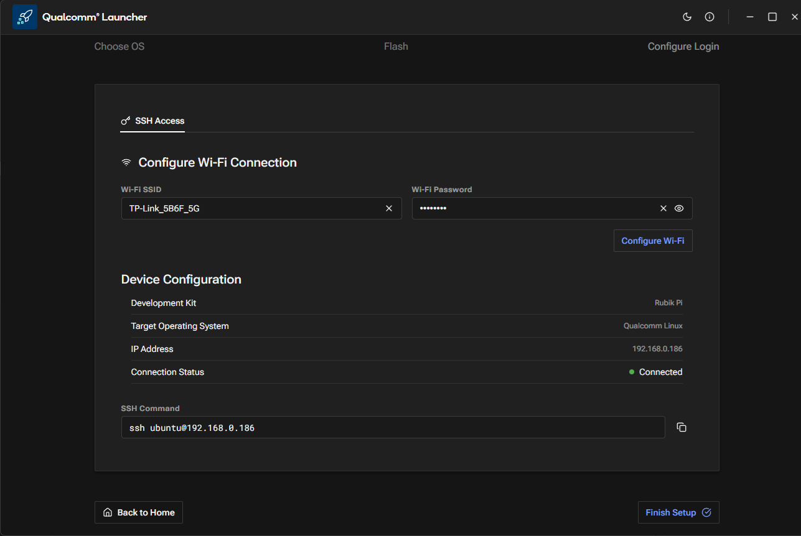
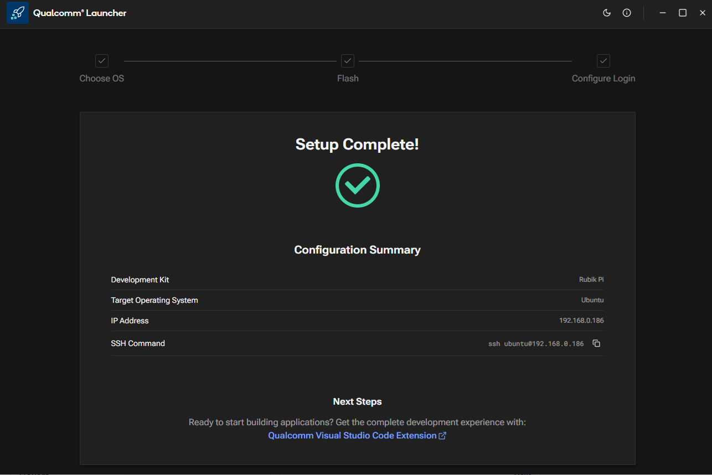

import Tabs from '@theme/Tabs';
import TabItem from '@theme/TabItem';

# 使用Qualcomm Launcher刷写Canonical Ubuntu 24.04
 
	Qualcomm® Launcher是一款用户友好的、基于GUI的工具，简化了将操作系统下载和刷写到基于Qualcomm®的开发套件的过程。本节提供了刷写**瑞萨 USB 固件**并将现有操作系统替换为**认证的Canonical Ubuntu 24.04服务器版**镜像的分步指导。
	
	## 操作步骤：

	### 1️⃣ 安装Qualcomm Launcher
	**a**. 访问Qualcomm软件中心：**https://softwarecenter.qualcomm.com/catalog/item/Qualcomm_Launcher**
	
	**b**. 根据您的主机选择适当的**操作系统类型**和**架构**。
	
	**c**. 选择最新版本并点击下载获取Qualcomm Launcher。

	:::note
    **重要：** 在Linux主机上，需要Qualcomm Launcher V1.2.2或更高版本。
	:::  

	  

	**d**. 打开您的下载文件夹并运行 "Qualcomm_Launcher.x.x.x.Windows-AnyCPU.exe"。
	
	**e**. 安装成功后，您将看到**Qualcomm Launcher**应用程序界面。

	  
	
	### 2️⃣ 刷写操作
	**a**. 在Qualcomm Launcher中，选择**开发套件**为RUBIK Pi，**目标操作系统**为Ubuntu。
	
	**b**. 将设备切换到EDL模式（您可以在应用程序中找到说明）。一旦进入EDL模式，魔方派 3 将被自动检测到。

	 
	**c**. 点击Flash按钮开始更新瑞萨 USB 固件。
	
	**d**. 进度屏幕将显示USB固件刷写过程的状态。

	 

	**e**. USB固件刷写成功后，将出现以下确认屏幕。
	:::note
	在日志消息部分，您将看到平台镜像正在下载，刷写构建过程在后台运行。
	:::
	 
	**f**. Qualcomm Launcher等待用户操作，将设备置于EDL模式，您将看到以下屏幕。

	 

	**g**. 一旦设备被置于EDL模式，刷写操作将自动开始。然后您将看到以下屏幕。

	 

	**h**. 操作系统镜像成功刷写后，将出现以下确认信息。

	 
	
	### 3️⃣ 配置设备
	**a**. 操作系统镜像刷写完成后，Qualcomm Launcher将重启魔方派 3，进入新安装的操作系统。您现在可以继续配置设备。
	
	**b**. 点击Configure Login，将显示以下屏幕。

	 
	 
	:::note
	如果主机系统上的MicroUSB COM端口当前正被另一个工具使用（例如，**PuTTY, Tera Term**），请在继续操作之前关闭它。
	:::
	**c**. 一旦Micro-USB电缆连接（如上面屏幕所示），Qualcomm Launcher将提示您配置Wi-Fi。

	
	**d**. 输入SSID和密码配置Wi-Fi。

	
	**e**. 点击Finish Setup，出现以下屏幕。
	
	

	成功设置Wi-Fi后，用户可以选择以下路径之一进行应用程序开发：

	:::tip 
	Qualcomm Launcher无法启动或崩溃
	- 确认您下载了适合您操作系统和架构的正确版本。
	- 如果问题仍存在，请按照[**手动刷写**](../11.Troubleshooting/11.1.flash-over-android.md)操作。
	:::


<Tabs>
<TabItem value="IDEMethod" label="IDE 方式">
	**IDE方法**：
	使用Qualcomm® Visual Studio Code Extension在基于Qualcomm®的**魔方派 3**开发套件上创建AI和多媒体应用程序。这是一个为Qualcomm开发套件提供的集成应用程序开发环境。该扩展在Ubuntu（或带有Ubuntu的WSL）中运行，并支持设备配置、软件开发，包括编译、调试和二进制刷写。
	
	有关更多信息，请见[**Qualcomm Visual Studio Code Extension参考指南**](https://docs.qualcomm.com/bundle/publicresource/topics/80-79972-1/quick_start.html)。
</TabItem>

<TabItem value="ManualMethod" label="手动方式">
按照下面的手动设置过程进行操作。

		#### 1️⃣ SSH连接
			**a**. 获取魔方派 3 的IP地址。
			
			**b**. 在您的主机上使用SSH连接到设备。
			```shell
			ssh ubuntu@<IP Address>
			```

		#### 2️⃣ 安装预构建包
		在设备上运行以下命令安装预构建包：
		```shell
		git clone -b ubuntu_setup --single-branch https://github.com/rubikpi-ai/rubikpi-script.git 
		cd rubikpi-script  
		./install_ppa_pkgs.sh 
		```
		
	<details>
	脚本安装以下内容
	* 安装AI示例应用程序包。
	  (gstreamer1.0-plugins-base-apps, gstreamer1.0-qcom-python-examples, gstreamer1.0-qcom-sample-apps gstreamer1.0-tools, libqnn-dev, libsnpe-dev, qcom-adreno1, qcom-fastcv-binaries-dev qcom-libdmabufheap-dev, qcom-sensors-test-apps, qcom-video-firmware, qnn-tools, snpe-tools tensorflow-lite-qcom-apps, weston-autostart, xwayland)  
	* 安装魔方派 3 摄像头、wiringrp和wiringrp_python包。
	* 安装通用开发工具相关包。
	  (ffmpeg, net-tools, pulseaudio-utils, python3-pip, selinux-utils, unzip, v4l-utils)
	* 执行`sudo apt upgrade`操作。
	</details>

	:::tip
	如果包安装失败，请运行以下命令：`apt --fix-broken install`
	如果您遇到以下错误，请重新运行install_ppa_pkgs.sh脚本。
	GPG error: http://apt.thundercomm.com/rubik-pi-3/noble ppa InRelease: The following signatures couldn't be verified because the public key is not available:
	:::

		成功运行install_ppa_pkgs.sh后，可以在显示器上看到以下屏幕。

		
	
		#### 3️⃣ 验证软件版本
			在设备shell中运行以下命令来验证版本：
				```shell
				cat /etc/os-release 
				```
			输出：
				```json
			NAME="Ubuntu"
			VERSION_ID="24.04"
			VERSION="24.04.2 LTS (Noble Numbat)"
			VERSION_CODENAME=noble
			ID=ubuntu
			ID_LIKE=debian
			HOME_URL="https://www.ubuntu.com/"
			SUPPORT_URL="https://help.ubuntu.com/"
			BUG_REPORT_URL="https://bugs.launchpad.net/ubuntu/"
			PRIVACY_POLICY_URL="https://www.ubuntu.com/legal/terms-and-policies/privacy-policy"
			UBUNTU_CODENAME=noble
			LOGO=ubuntu-logo
			```
			运行以下命令查看Linux版本：
				```shell
				uname -a
				```
			输出：
				```json
				Linux ubuntu 6.8.0-1055-qcom #55-Ubuntu SMP PREEMPT_DYNAMIC Wed Sep 17 02:03:34 UTC 2025 aarch64 aarch64 aarch64 GNU/Linux  
				```
</TabItem>
</Tabs>
> **🧭 后续步骤**  
> 镜像刷写完成后，请参考[**应用程序开发和执行指南**](../7.Application%20Development%20and%20Execution%20Guide/index.md)。