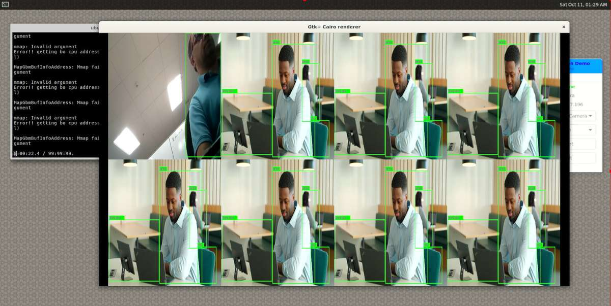

# Qualcomm® Qdemo

Qualcomm® Qdemo 应用程序提供图形界面，用于探索由 Qualcomm 智能多媒体产品 (QIMP) SDK 提供支持的多媒体和 AI 示例应用程序。Qdemo 专为使用基于 Ubuntu 的 Dragonwing 主板的开发人员设计，无需手动编写 GStreamer 代码即可快速评估 AI 管道和多媒体功能。  得益于 QIMP 的零拷贝架构，这些应用程序通过利用 GPU 和 NPU 加速展示实时性能。  QIMP SDK 处理视频捕获、调整大小、裁剪、推理和渲染等任务，所有任务均通过 GStreamer 插件进行协调，例如：

`qtivtransform`：加速 GPU 上的颜色转换、裁剪和调整大小。  
`qtimltflite`：在 NPU 上执行 TensorFlow Lite 模型。

这种设置使得开发人员专注于评估性能和功能，而无需关注底层实现细节。

## Qdemo 入门

要开始在目标设备上探索 Qdemo，请按照这些分步说明安装所需的依赖项、配置系统并启动图形界面。

#### 1️⃣在启动 Qdemo 之前，请确保目标设备满足以下所有先决条件

* **Ubuntu 操作系统已刷写** 并且终端访问可用。
* **启用 SBC 模式**并连接 USB 鼠标、USB 键盘和 HDMI 显示器。
* 连接**CSI摄像头**
* 连接USB摄像头
* 如果您之前没有安装过 PPA 包，请按照以下步骤进行安装。

```shell
git clone -b ubuntu_setup --single-branch https://github.com/rubikpi-ai/rubikpi-script.git 
cd rubikpi-script  
./install_ppa_pkgs.sh 
```

#### 2️⃣ 安装依赖项

从 SBC 打开终端并安装以下软件包。

```shell
sudo apt-get install libgstreamer1.0-dev gstreamer1.0-plugins-ugly gstreamer1.0-libav gstreamer1.0-alsa gstreamer1.0-gtk3
sudo apt-get install python3-gi-cairo gir1.2-gtk-3.0
```

#### 3️⃣创建媒体、标签、模型和数据文件夹并将所有者更改为 ubuntu:ubuntu。

```shell
sudo mkdir -p /etc/media
sudo mkdir -p /etc/labels
sudo mkdir -p /etc/models
sudo mkdir -p /etc/data
sudo chown -R ubuntu:ubuntu /etc/media/
sudo chown -R ubuntu:ubuntu /etc/labels/
sudo chown -R ubuntu:ubuntu /etc/models/
sudo chown -R ubuntu:ubuntu /etc/data/
wget -P /etc/media/ https://raw.githubusercontent.com/quic/sample-apps-for-qualcomm-linux/refs/heads/main/scripts/download_artifacts.sh
wget -P /etc/media/ https://raw.githubusercontent.com/quic/sample-apps-for-qualcomm-linux/refs/heads/main/artifacts/qdemo/Qdemo.gif
wget -P /etc/media/ https://raw.githubusercontent.com/quic/sample-apps-for-qualcomm-linux/refs/heads/main/artifacts/qdemo/Qdemo.png  
```

#### 4️⃣ 启动 GUI

gst-gui-launcher-app.py


#### 5️⃣选择Wi-Fi连接到Wi-Fi网络。

#### 6️⃣Qdemo支持的示例应用程序列表

您可以选择“On-Device-Camera”或“USB-Camera”作为Source，并运行示例应用程序。

| 示例应用程序| 说明
|----------|----------
| Record live video| 记录摄像机画面并保存最多 30 秒的视频。
| DashCamera| 多摄像机流传输
| VideoWall| 执行 MP4 AVC (H.264) 视频的并发视频播放，并在视频墙显示器上进行合成
| ObjectDetection| 物体检测
| Parallel AI Fusion| 对来自摄像机的输入流执行对象检测、对象分类、姿势检测和图像分割。
| Face Detection| 处理来自摄像头的输入并使用 Qualcomm® AI Hub 检测模型生成预览。
| Daisychain Pose| 对从摄像机流出的图像执行级联对象检测和分类。
| Multistream| 显示来自相机或文件的输入流的 AI 推理（对象检测）。

#### 7️⃣运行Multistream Qdemo支持的示例应用程序

下面截图展示了Multistream Qdemo示例应用程序运行八个流 - 一个直播流和七个视频流：



:::note 在 Wayland 输出中，拉伸 Gtk+ Cairo renderer，确保正确显示示例应用程序的输出。  
:::